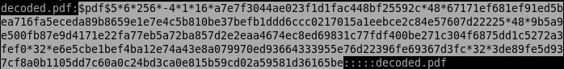
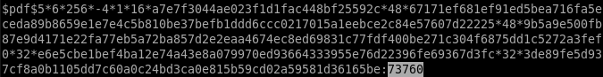

# \[Crypto\] - Result

#### Points = 100

## Prompt

I really want to know my test result, but unfortunately its additionally protected. I attached the email. Maybe you can help?

Author

rugo|RedRocket

#### Hints
\[None\]

## Provided Files
[files](../../files/cybersecurityrumble/result) - link to files

- result.tar.gz
	- a tarball with an email inside.

## Write Up

- Test-result.eml is an ascii text file to we can read it directly.
- if we look at this we can see that there is a pdf file called `result.pdf` which is base64 encoded.
	- we can decode this using python but I'm feeling lazy so I'll use [cyberchef](https://gchq.github.io/CyberChef/#recipe=From_Base64('A-Za-z0-9%2B/%3D',true)&input=SlZCRVJpMHhMamNLSmIvM292NEtNU0F3SUc5aWFnbzhQQ0F2UlhoMFpXNXphVzl1Y3lBOFBDQXZRVVJDUlNBOFBDQXZRbUZ6WlZabApjbk5wYjI0Z0x6RXVOeUF2UlhoMFpXNXphVzl1VEdWMlpXd2dPQ0ErUGlBK1BpQXZUR0Z1WnlBOFpXVXlORFpsWlRSbE9UTmpNVEUzCk5XRmxZV1kxTkRRNU56UmtNVGd4T1RRd016VTNaV0kzTlRVM1lUTmtaVFZsWm1Rek5EazJaamMzTXpFME0yVmpZajRnTDA5d1pXNUIKWTNScGIyNGdXeUF6SURBZ1VpQXZXRmxhSUc1MWJHd2diblZzYkNBd0lGMGdMMUJoWjJWeklEUWdNQ0JTSUM5VWVYQmxJQzlEWVhSaApiRzluSUQ0K0NtVnVaRzlpYWdveUlEQWdiMkpxQ2p3OElDOURjbVZoZEdsdmJrUmhkR1VnUEdWa01qTm1OMlF5WXpNME9XVXhZek16ClpEUTJZVE5qTldNek0yUXpOV1ExT0dJMk16ZzVabU5qWkdGaE56bGpZell3TURGa01XWmpPREkyT1dFeU9URXpPVEZqWVRBeFpUa3gKTmpBNFlqQTRZak5qWVRBME9XTXpNbVUxTkRVMk1UNGdMME55WldGMGIzSWdQRGMyWkRBd04yRmlZakUxWldKbE0yWmhPVGRqWkdJMgpZek5tWXpJNVltTTFNekJoTm1OaE1HRTJNV0ZpT0RreVlqUmtZekZtTlRnM1lqUTRZVE0yTURBK0lDOVFjbTlrZFdObGNpQThOVFJrCk9HUXdZVFE1WlRnNU5qUTBOamc1TldKbE9HTmtaV015WkRjM1pHTTVZakJtWmpsa1pESXlZekJpTUdRMFlURXlaV0psTnpobFpqTmgKWlRneE5HUmpPRGN3TjJVek56WmhaalV4TlRaaU5qRm1ZekZoTUdNMU5qbGtZekZrWm1FME1EVTNORGRqTTJJNVpERmpNVGsxTXpWagpORE5rWWpabFltWmtPVFErSUQ0K0NtVnVaRzlpYWdveklEQWdiMkpxQ2p3OElDOURiMjUwWlc1MGN5QTFJREFnVWlBdlIzSnZkWEFnClBEd2dMME5USUM5RVpYWnBZMlZTUjBJZ0wwa2dkSEoxWlNBdlV5QXZWSEpoYm5Od1lYSmxibU41SUQ0K0lDOU5aV1JwWVVKdmVDQmIKSURBZ01DQTJNVElnTnpreUlGMGdMMUJoY21WdWRDQTBJREFnVWlBdlVtVnpiM1Z5WTJWeklEWWdNQ0JTSUM5VWVYQmxJQzlRWVdkbApJRDQrQ21WdVpHOWlhZ28wSURBZ2IySnFDanc4SUM5RGIzVnVkQ0F4SUM5TGFXUnpJRnNnTXlBd0lGSWdYU0F2VFdWa2FXRkNiM2dnCld5QXdJREFnTmpFeUlEYzVNaUJkSUM5U1pYTnZkWEpqWlhNZ05pQXdJRklnTDFSNWNHVWdMMUJoWjJWeklENCtDbVZ1Wkc5aWFnbzEKSURBZ2IySnFDanc4SUM5R2FXeDBaWElnTDBac1lYUmxSR1ZqYjJSbElDOU1aVzVuZEdnZ01UYzJJRDQrQ25OMGNtVmhiUXA4eEo3RwpEVE9LektWVFpWdGlHTC9BQ3NISGZVNWtpSU8wdzBHekJCanpYRlo3OTA0MjJlcG1DS3NMLzhmUENGbHA3SDVEYThxTmhNWElsQ01jClVnR2FCTDM4L1gwSDRScHU5U0pYWjhpRERhME5sRFNGZVpFSkJhdEVZdHROWHU1ZitQK2hSZzl3Ny9BM2QyNFdhdFBMSTM5alZTU0UKY1BiMVd2SEw5MFdmOG90NFl0Nnh5R1c1ZWd4U0dTRW1vazRNWlZJbEJ0T0ZLZS9USVk3cDYxUVdHdG90V2U0c2VINjdLdjh2ZW8vVQpqMlZ1WkhOMGNtVmhiUXBsYm1Sdlltb0tOaUF3SUc5aWFnbzhQQ0F2Um05dWRDQTNJREFnVWlBdlVISnZZMU5sZENCYklDOVFSRVlnCkwxUmxlSFFnWFNBK1BncGxibVJ2WW1vS055QXdJRzlpYWdvOFBDQXZSakVnT0NBd0lGSWdQajRLWlc1a2IySnFDamdnTUNCdlltb0sKUER3Z0wwSmhjMlZHYjI1MElDOUNRVUZCUVVFclRHbGlaWEpoZEdsdmJsTmxjbWxtSUM5R2FYSnpkRU5vWVhJZ01DQXZSbTl1ZEVSbApjMk55YVhCMGIzSWdPU0F3SUZJZ0wweGhjM1JEYUdGeUlESXdJQzlUZFdKMGVYQmxJQzlVY25WbFZIbHdaU0F2Vkc5VmJtbGpiMlJsCklERXdJREFnVWlBdlZIbHdaU0F2Um05dWRDQXZWMmxrZEdoeklGc2dOemMzSURZMk5pQTBORE1nTXpnNUlEVXdNQ0F5TnpjZ01qYzMKSURJM055QTJOallnTlRVMklEUTNPU0EyTmpZZ01qYzNJRFV3TUNBMk1UQWdOVEF3SURNek15QTFNREFnTlRBd0lEVXdNQ0EwTnprZwpYU0ErUGdwbGJtUnZZbW9LT1NBd0lHOWlhZ284UENBdlFYTmpaVzUwSURBZ0wwTmhjRWhsYVdkb2RDQTVPREVnTDBSbGMyTmxiblFnCk1DQXZSbXhoWjNNZ05DQXZSbTl1ZEVKQ2IzZ2dXeUF0TlRReklDMHpNRE1nTVRJM055QTVPREVnWFNBdlJtOXVkRVpwYkdVeUlERXgKSURBZ1VpQXZSbTl1ZEU1aGJXVWdMMEpCUVVGQlFTdE1hV0psY21GMGFXOXVVMlZ5YVdZZ0wwbDBZV3hwWTBGdVoyeGxJREFnTDFOMApaVzFXSURnd0lDOVVlWEJsSUM5R2IyNTBSR1Z6WTNKcGNIUnZjaUErUGdwbGJtUnZZbW9LTVRBZ01DQnZZbW9LUER3Z0wwWnBiSFJsCmNpQXZSbXhoZEdWRVpXTnZaR1VnTDB4bGJtZDBhQ0F6TXpZZ1BqNEtjM1J5WldGdENueVROajladnJJUHZacHM3cGUwVEVNUkdlZkoKdVlrRUErSXJBR0s3UHlXZWw0Z3k1Szk0YmViNm5hNUZoQmhOVnNiV1lzL0I2MWlJRlZVRWVNVnZpRERLSnNwOWRLZHpTZWtyOE5aSApKbUUrUXRLUHJyQ2d4WmZDbnZEc3dGRmMxb2dzU2tydUpiVTNXdU8vWXVrOVBYeFZLa1U5V1d0cW44LzBYa3g5NDJSN0o3MDloMDBFCmFzbnVqcEtTRDdPcVdIWllSK3NleGlwQWdMQ01NalhqSThCQ05QU0UxeVR0UFZ0eDd4eTZaTTV0RkVzVlkrbm1uUXJNZUZsMGpGdUsKaklDNCt3MDRYWWpSdjZmQjhEMEs4ZmtUNElJQmtsT2VJcnl6a25uTnUvOHJtZkZtNjBJNHB1ZnVmM1RGV2ZKZUdEcW5EcmZrM3UwNgpNeGVXekVMaE1HcWNuVjRXM3JVWkV4RW5GVFBpUGp4eUdEczRCZ3g3S2hNK3V0U1RrMjY1YzgwcHBIYy8xQXpEZit6R3NzaDBhbDlMCmFmSTRqeVcyYm1lN2xLZVdHWXdQTjRNQlNFQmNBQUhvYlE2QUh3emNpV1Z1WkhOMGNtVmhiUXBsYm1Sdlltb0tNVEVnTUNCdlltb0sKUER3Z0wwWnBiSFJsY2lBdlJteGhkR1ZFWldOdlpHVWdMMHhsYm1kMGFERWdNVEkwTXpZZ0wweGxibWQwYUNBM05USXdJRDQrQ25OMApjbVZoYlFxQWZxZXpOZ2JtaCtPbUU4UUIvR2pFb1dSaHE0TUFwWWhYMkFSV1lneWtHZlF1MmVzMmgvb0Vnd3lhYUNkcVlQOUlFbVdrCkZSQXgycjAyL0w5bkwxU3o3OFZwaXQvaGgvQ2VMTlpFRWUrano4SVR5aDViT2wzazd5Z0xFUVhhK2NDcVdYSXlwaFFnWW5ySDViUEgKY2dMWnFPOXBVdmtOUVp6QnhwMVkwNzdHSEIzL015R3Z1ZXVkTHVKdDJVMjZXdTFZempPM2FlTU1SMEJaSmQraDJWd002NEtGSTVLQwpLaW5ldmUvVCtFQzRCanM3Y2JBWXBhQWVHcWdTdXBqRXF5Y2g2YmhIcjNrNjVuTTl1YnorVVVKN0xtWG00WkxVcDNhS1Vza0UzcTlJCjZxKzIrODZERGRXZTlhd1lNT0dsVTVUMmlKZTZ5U1NZUVNIVkpobGo0aStTU1gwKzJadnlKV2hwZTdyeTVBODVCa0tDbkZPRW9zc1kKV2txZ3dhTUFicno1ZkQxOEdSVnhZNmpqNmdzRDZPWXNuWWZzR1YwdG9zR2hUNU1wc1RHYkxHMitBRXJKRTh6WFo3VkdYMWpEZzNDVApyYVBQUk9OSTdPRU5LRWJuZnpyNzBibTNsSlh4UE1rUCtWUFo5anBjdUdUS05adG1kbWpMSWdYdDh3NE1EMDkxcWdqQ0hHUG45NDV1CnNCeGdaTFFwdnVWTTVzc2VyNG5rcVRldnZwdE9EMTl2WTZPNDFvOWFCSDRhZk5NRFIremRNWnFqWEdSb1dIbTFwbjFweFA4Mk5tTk8KeXJ4VHE5NW0vcTlZQ2MxMnBRTHBOQUdHMC9HUXhtSWhldGF2QkJNSy84ci9nTzFPNFhhNUZWaTFFQy9uaGgvcUg4cTQwY0JZTjh3TgpXWVBqUUMydlgveE5BOG9zZmtxU3MvVHpvaWRKNjdsRUVNa0NEem5zaVlpakRlSkRLL21xY295dEEyTlVrRzdKU0RBSm12WERBY0ZuCkhyMk40NnBwWnJET1A4RUhsbG84dGgxcEo1ZjdHQk5WeG00YWxCVkdmVnpjMGFzT1dDRk9FNlVMZXZMcGZ5K1h4ZFVMOHl4UUJKT00KaWZnQW5NZWxMV0hBZkprZHEwdWRLU3luOTFKeGYyclpmOXg3d3lNUElKRUk0Q1MxVU9mNjNQU1JFc1Exb1RIdDFzcWVlRDcxT0srOQoyL1Ayc0dOU1BYbWlrbnNHekdpckNVelBBZ0ZlYmVyaHhYVU1wMHpjdzVKNFBRVis2N1pXQXUyUzJCZnFMa2UwNmVBNFU0YXZJbEN2ClRsUFlNbjNxMUVBcGhleE9sQVBIaFZMU1ZINmsvT0ZtWFEyd2JwSTg2UzhySUN3MGZXeWIrZkc1eFdsdnJMdU5wVVI3L0toNEIyWEwKQjZDTDVzblpTSTJEdjVJMHBVb2gxSjRlYzY2ZEd1NnAxTFd3RjBTMmVsUnNSM29hQS9zVUp1Ri9HZWl5d3JxVUdSbWIvTThGWmUyaQpRa2EyalZvQWs4c0M3WFlkS0NaSFRCTC94dUFidkxXSmZJNEJnN0diSmYrUXd3SjFtRlQ4blNkZjhGNHFEQk01TzZmeUJma1FPR2QxCmxna0R6eVpLUkI2VnVaYjVqc0phZjNaVExHalZuclF4VHJiUWpzMHVwRE9zZ1cvNDlLZkhyd0lpQ2dIalc1Y2VaR3RtcFVoc0pRaloKdGowYlRRSHN3d2pmdWxieXkwR1ZkNXcvSGtLZmdveDRjc3I4U3BxbDgzR2FkbTJ6YjlKUG9FRk5NN0hyekJtcEl0NENDZjdtR3JhdApGMlk0d2FHQmtabDNBRmtaZzBmWVN0K1FMK3RPNHFhdi9HUVZWMjVvcFptMWZHT1p0YjlleEU1Q2lTNHorUE9ORDZMYlV1L0hpd2xRCnFWUjJFTlF6L2ZXb29MTks5d2RyZXdxSUV4RDBYODhzZ3N3ZEhHMkU0SjdqK1prUFJwWmhoRG1nYjAvNHMwSENhaFE3L3BjQmpxTDMKMjVKWmdJbm9yWkdSMXFTRTRtN0w3WHBGeDJhWjliN3hJMnJyWFI5aGhMTW84RjBnYkJoMDhqbzFDSkRnVFpxYjludyt1bmZ2bDJibgo1VHJkcU8yc3lFdHluNHJyaDRMcldKa1pTSk9CamxEalZTd3drZWEwaTZ6UWphYjZtNlBpbkc4MmpXMGFZZDJYZ1pEYWxhZXA3T3h4CjVxVFVsbmFtdFE5cDVHc1FBVDAzWE1KcUZ6TTBLZGFrTUJ2Z0o2LzdUbVpUQStnM1c1bzRObkcrOUx3dndHWDdTK0FXekVnMVNwdWcKOTk3bElmMFJ0K0VkMXR0ZTZrV1MrSmphVlZEQ0ROa0QvaEJpZ3lucHRvT25QMGF3QVJRbWJXcVZRem16d0lITkd1NnkwTmx2d1dUSQpvSDhheWNsdGtkU01kUFVjMnVPNE9oaHg2VmRFSXVNZzdEZFA1QThsZ1RROFFJTlJGeXZpT0ZkWkJhRFpCbGhvd3owaDB4RTFUZkFLClBvT3ZkeDFxUGNIcE8vNXJ0VXhkVVFVUFVWS1lOeVZPQVR3NENkYTQ5UDIwUWhsUFJzZFZLeERWR21PRHpWNjJSZ3ZjNlRJTlBCa0IKcHBqTjVVYXByNVZDK2N6QjRDbmFGelZvMW5PTVh6TjhTT1lTeC90eWtSM28yc0hjZHlBOWtiWStkNW0yaHJSUkdEVWRhVXhpYTY1UgptY2hQQUpNV055M3owbTRBdmVFbVhwVld2MDlXc25oL3JvWHpFMFpaMXlsU1ZDbGxqWnFCeFVXeFdOdTRxOWtJSG4rb1NuK1dXNkkzCjhLa2M3ajRKUWhpUjRUUDBPd0E5UmZxK0M0Q0JFeklVb3V5a0lkRTZCVEtnL2pqWFVOMDJPMVVTVHg5Q0c3b3Q0cWVLNXNhWUxHTWUKM0NsRE9CKy9NY0dwVkcrVzA5QU0rYjhpTmQxRnZETXdJbUQ1NmFsbFhQN1ZBTVlNV3VVeXRJbFRkZnNCOXVHc1EzMTVua0hiczQxUQpwTUgrQXhtbU95UGcwbmpJMnhyemt3VHlTMThJOVdsd1krcndSdHgvUldaV2NRd3dhdDJpVkdKTWUyOGlvQ3oydHp1Z2sxemVxWW5iCnRZME41SWcvT05sSmp6dk1zcXFWMTgwM3NBODE5a3hxS0pBS2NRUXZMS2hkbVVuWllqSDdrckdFWWtFd3RVaW8yUU8wdUFGSDRkSzYKbXJuUndWdGIrSjZ3M040OFVMUHdTV2QxZGxibTNidkE0SzdHODRCeVVDbUJ0eTJJemdvZHVYTmZnR3ZiekdmTml1dEdwUU02dnNadQowTm1HNFdWY3B1dFlXNitKc0xDeldXZE5yaGlxbkhpRk1YRHpjcEVWK1NWWDRQQUdNTEIxeW1VOFpvTEIreDNWK2R6VFRJbyttT2NVCjAzYW9JdGZjaUhCenQvK1VZNWRKWThFNXQ2MHhVdS91a1oreWticHJLbDRqSHlLdmZrSmFsd3BvWm1ZTmdrQ0tVZDhPR0kvcXB1Q0EKMG16cHJRandCYjlybXRYdTNYTzIwdkNjREtrbVA1OVhwMDAxTnZUZ1hURDhYQnBTZjNDQnJYazQ3R3RJS0I4NUt6Qlh6Z0taQXdoUgpXdFJKcDVMbi80N3BOcmJib3ljeVdpT3BKQnh3NWV6cTVXY1RlT2hCd09sZm0zd0JXRGJLMVc1YkczY0VSOHBtTXpvTTlYZFY5eUxaCjY5M2JDNkxhOTNuRWxFKzFka1lmQTg2NDFuUHdJU0xCbVYyYVV5TVZpOThGbG1uVVQrMlB3UmEyQXBndVkvdHN6dmc1NTZCVmcxbngKU2xrcWV1cGF2Sy9NZUpyNmJpT1drend0VlE5TDVRcUhYTHRBdkhMOE5PNGx5Y3JHYzI3MXU5UTRzZU12THk2UDZXQmlRWFBVWnNnZwo1WEUvaFZ4Z1lNNkxVN1Y5eUVxSXBVRDhMbDQyczJZbThvbWh1QUFXUmtML2F2U29vQm1uNTJvU3BiWlFlYmppNHVaMUlKcXRpM1RKCnNROVdnNHRxYUt5cG9GRlIyUmN3OVVZY0djUlpZK3prTEcvZEV6YnQ5dWhuUmVHRHdBM1o5eFhqbDY3eEhBUzFSRXAxSlU1bzJhaHYKZTBRSHl3YmExUGFzVTIyL09jbmllbkRmTmdKdlh1RDNLZm5DS25ZeVArQVlranpzV1U4azFCTVdxM1cyelFtWGtVYnNSL3A5N3czUgphNWhBc2lVZ25JMHR6aGJyT2xvQ3JUTGEvdFRKWXZDNVFZYTBMMDZoN0F4bkQwdzljekVFZGt3UTkxK2QzL2xpN290NnJDejNMWmNPCmRNV0d1T3FreFA0allQSEVZMHhZbkl6elpPMWptTjAzT2lxcVBibHQxNXhUWlVRTWJhbmRiUk1TRWl4MVMvdDZWaFlJV3QrTXJyeFIKQk51bEsvQ3o0MWh0c0JGcklMWFpHWkZ1WTVvcmJKS1gzaWpVeU9LZzhIMmp2SlBVZVVxVmszN3BUR2o2eVNhdklCZWhnbWs5UXl0Kwp1bkpySndDN0FxUnJRODFLUnJ4aUVqREpETVpBU09xRk9KejF0OUV0RThoWGQrQ3A4bHlTYnRsZStpdG9GMmVsMDdTZGZKeEgrN09KCkhIUXI2WmpvcHk5WXhGV2JERVRmU0tEMkdpTGVPTDN5UlRaSDNRRmxNQk52NSsza1R1NWZudW10dkwvQjFZbFRLZ2EyRTE0VnlPOWMKdHZXWUxLMkZ3SG8vVThhWkRVVXptUkZDVExiM2hDY1hhaStpcGZkK1Q4U2FHRnRNMC9SUDNIZjdvdnZpbWlzR0E1QjRRV0JjVUJLTQpvOEdEeHlVbTRlMXRpTGdueWhSQ1dRRVNzdFdaTFFUL09JL2R1M3QwQmcwOGdsZFU0RndQYWMvdnNMci9CV3BEMzJVTmxremNLUFpJCjY5cnpPalRyU1ZBekp5bUxBVGZKZXFlaEszcytkQngvd2daRlRXdnY2d0RLM09ZL24wTGtpdW1saCt1c2wvZGdqMjhCSDFMU2N4c0YKb2pxWHdrNUFiZVE3bjVYUExWY01mbkpkL0NYYUxWY004RmVDL2ZWZG1FbnJaVDM1RGFUdXhaWTdDZDlTdnZyQ3J2RU5UTVdxZHFwSQozUmVFUVJLdVp6T0J3KzZSU2JZTEwxZm5adkdtSEtYdUwxeXJyS01CR3MyZFpDUWphaDdTWW4ya3hYd2M3R3BWOTF2aitqcVkwclo2ClNYL21YdnlxUzMycjVtT0RZRU5DOTQzQ2QrY3lUT25lZ0FMT3Mzb2tDZEV6K2lDbS9oeE4ySlVELzhTTEZUd05nU2QyOWFaUXBmeEoKdDZhYWREVC9iVGdOL3ZtQjVVY25oMTRLNDk4YTEyNFlURjk3WmcxNkFzM3JldEw3OWNTMWNRS3djUGN0UkFLZDVmdmJmQVcxRWhrSApmSm43MzNydThBNkdUQ05VSUFPTjVNMkVuRlBsTkRJY2NDbjQvemNHVHBOZE1ZU0pZeTgyNXo4cUg5K3IzVWpDcmhRU1kzK0IybGxyCi8vUTh0YVdCNG8rQVlNZno1WVZhb3ZOSVE5azBrRzQ1Q25mUVJ1MXVjdnpGamdwMUJPOWJ3NFFSQVdEMUFIeW1MZ0R6SFpEa3dJSy8KYVdDSTV4YytPNmNzQVEwMmNwN2hEcDE2VHBET2grK3dHMG9ZSzdWU3FRT29PYlNMRXV1MkpKR21BenRCQ2VnbTFxNzlxMkNySWh5YwpKVE96cnNGTGVtaGpoczRFTlo3V0NpT1pUWWtaRHcrVUNtVEpEWU5qTTg1dEY5SkNyMDdQcUplTk9xcjlIbE41ZERhOGl3azdsdkF3CnpXbVNlakY1Z0V5aER4ZGVsTnpWaGVFcWxxejhQTEh6aHpsRUtkMW1QWTRvbHJqd0V0QTdxeVViM3JPYzJyK1JqQWhuS3lQS1lqZUYKT3pkaXNJVUZ2ZDFyWTdGQ1gxSXNVMkQ0d2NGOWdCL3k0UVNmQ3JJRXU3b0pUNHVDTm1nYXZjWnlHVTNSZ2NvUXJNZXR4S085YmpvZAoyd3pQdXlkUWZma2lhVFlmUVhOL0tHNTBnRCsrcmxlOGhoRmg5b2FEL2lQbDRvQmNPRTNPYWgwRXkzVllQT3NqdkFNUDlXQmt4ZmFHCkMzZUl2VXZSWnhEQ1hHUVltQkxTNXMvcHBGMnJHWHlHbzhkQWxRdlkwaXIrbHpjczlqeXMzakkzOHlNTWdGMXI0RnIvTUdHMTYzS1kKcGxsQlkyOGUrbUhsNEE4RmFtY1hnc0FKY1NzV1UyUWNSRUtnckJuZFJPN1Z1UDhDK3I2QmVCYnd0Q2JWaTNwdjE3WWdKR2gzWlhEQQoyQm8yMk5jSUY1RVhSZVNSMy9CTzMrOUU5ZENOZTVxWUp4SDlrZW1FZGVmazNCckRrSHlkTmtGT2pQZWdGUmdNZ2c1RnRwU2tTTDVWClRraUJpbkJBSmxLbStrR0VYWEpuVjhuZy9pb2wzYVMreGMvUXJ3NmRTV2lEcVZCSFFQei9iM01kT0ZWTDBNcXl1dWk1QmcrZHdGd3YKUUN0aW83ZkYySFhVWGtWbW5hS1JtNTlraXRHZTc4QWwvSmVlNW5UUnV6MU1CRGtUKzA0YmNpNzZDSmordkpRSmlUWmNDR1ZFeFpyegpsdXpuUmc2d0cxOW84ZEtJUFJHczl5OTBka3VBVlJEeEdVZmc3bWg3cWdpdHg3Q0F4WStsMEhrR0RSV0YvWkNad1ZObXRmNnlya3BjCk1QOTJiMG1yUHRMM3RndEZOb3VKQUtlYzBQa0dQcHNadXA3L1drT2hEWW9xTzYrZWh6dTQ2by9TRURPZGxBQjM2UkZudTRCeCthcVIKa3FEanNoOFRuNEpxWHhFMjhLL09wY1R5TDRkYWJpc01DYnAvUk9Sa1R3V0hvc0grdzhPd1orK0EwUFJZMHh2dlQ1RFBEdWRTNG1ZdQo0SVRaRHJ3VUphODVLWE5mM05QYVJSVGRjS2ZNTlVMb2EwQmdCRm1oQ01pV1l4K2VYM0ZNcHNYcTh6eXZ5Uk1SV2FtM0FRdm5lMzRXCjNZZWNOYmZvY2lLQzdDMmtmbnRzR05WNnFlM1prVUNhVGdjV2JvSFdyU0FoellMQ1lDbmtIRGR2Y1B0M0cwVWpUdlhxcnR3WWoxMGwKWERWMnlXUDVvNG5YamdodVk5STJTL0UzUFhvRzQvclI5MTFLR2pVL1BoS1BsRjRsa3ZwaEt6V0s1emNKZjFsYnArUzVnb25zS3Q2cgprZjdhSUhSTUFMRkw2VUVlZ3JlSWp1Z29jYzM2QXVQelBGdXhsRTVRbEEyVnQwTk1qSkNuOGJMYjd1Q0xPV1FLcGI1NExiaENhWmtPCmo5MVpMYXhtV0cvWnpjL1lCN3dLWUNPcjZyWlB3NzQ4WGtrbEM3dUhnaDcvZndHU3FlakUvc0xSRnd5aU14MHFUOS92eDNLbkxubnUKa3YyL1lwRHl1L1k0MWJ6Q3NsNTN1RkU5dkhXcGhnSWpJek0vY0R6MU4vZzRucGV6T0dTd05ZZ1haS3NJbWJKM3lTVXhsallGUnYzRQo4Q2ZWeGUyTHB0RlNlc2pqRm9Oc1BETi9wNFNEb0hicnRKb2RuNkZ0bTlmWUo3VUZ3YjR1ZjZrQVFMTldvZjc0Z3lwdDh1RHE2aWlRCjJ4MGFxNzV0eURTV1lRb0lqL0M0Ump2VVh0UzBUYXJvclVKbjkrK3dVcGZyY0ZnUjlCUG42c3VaRjllZ2FQODlXR1pHQ3NMckhPbjkKM2hGMGdCN0d5N3FkTmcxR1RJNmFicDhPNWFUdE1WQXo3Vkk2MEg5TnJ2cCt5WEVqK3BrUlhNam5sVENCWTlHWC8yN3ZWV2crUlBuOQp5R2JNeVdOaWI0Q0hWYUVxTjB2Z2Y0NjB0elllajZiRDFvWnhKckNydnBPMitwMEdnRDBlcC9CUjF1bURkb1J4YW5BbHpFVFdHdUVHClRSeGRwbzJIa1gwZjFqNGZERThBMGF0aEFIZk45Um8xa09td212QzBDMkdMZEczZWRMYmVsNmNXb3ZGenlmYzV1cWlPVnpNNERmS0UKSjArVTVJbDNKa2NOUU1CTzVpcFdySzFYNTVoRGlqbktJbFpMSVp6ZlBxb3VKb1U0NHdZdnJ1Z1RoVnMwb0k3bDVqZExpcTdVYTdwWApaei9hV3VEWkRiMVBVUEJ2eG5zeFFkV055dUkrcmFRdXQzZXM2OVpJR3ZySFV3K2djOGpNMm53bHIvbUJqMEs5WG5WS3BwU2taeVV0CmlIdTdJY0NqWlI2bmtuaUpSeWtwM3Q5dnU3b3VIWTM0bXpzS0NGankrY3ZkQ0NoU2JvNUJjRVoxK3Z0SS8yd2p1Mzl1ejh1Y1R3emEKeEtWbzdvYXVyaGVhUEpWK0R4K1JnQXMxc0wyaEw3R3oyMjdBbjFGOWpQRTBoS0xVbGQ2TXFRZEZZcVV5blpMMHFnVmViVGZqREFJUwptMWxXV0Z3ZXVIOCtyc1B3Qy9LSEJzK2NhUkEzcG9sdHZ4NDE1SnJrekFuL3c4dFBjaFBkOHlFbmQrVmdxeFF5Zy9DNXZYSzhDM3ZwCm5WQzdUbEJaSGRJWlF1UXFiT0JRVG5rVXNjNGR6eEtKS0Vvamo0ak9DZDYwTzc4YmxEQWh6TzVwMHpDLzlEcEN4R1FoUUtsSHBMZHYKTjRlajVkQzhveEMxMWp3alk3b1NnY080TW1Iak5IQ2xGYktBK2lnY0FTOGpHK2R0ZmxqL2JocEk0ZEQ1bm1EdEpzeDJ2NTFJT0Q4dgpsT0ZkNkpTZ3NWTHZHWUpJZTYzWFpVaGxGTnBCend6VC84Y0ZOR0w4SzFVdmRtR1o0SWx0ZTNDb2FnQjUyOXpkMDlKVWQ2Z2k5dlNMCkt4ZG14QjdCSHVMc1IwZU1rN1ZRWmJkZUthSmlOYlhiQThWTkx4RlMwWGU3T280c213a0RzUmJZR01YbFVyRkZEL2E3Wm1uYld5Zm8KOHhQWURHMnByZUVGcGliNVBvY1RSMHhoM250Zkpuc3hvanpIZDdkL28raXNFemgyUzFFeWZoY08yY2dtc0lFNXlDWnA5cTM4cUM0Ywp2QXQ2MzQ2TkhRVDljMkJ5UFFIUVhkZVpVOGZTSkpoTkZGUDNLWDEwY3lQbm9NTTZwSGZrK1hxNnV0UGlZOG5xZVg1QUF2VXlseU9WCmM0Y3QrLzUrU3Y4NkFXK3ZTWHJnS250NFFSSDk2UUtjTElaQWZETllKdXNsSnA4dWtTUTRNRG5yNG5DV1psVXc4cHZtUHNDa2taWlQKUTBJTlgwdlZObXQ4djBkT3ZQdjR1dHJVdTNwZlpFOUtBaER3amFKZmlKQk4vOXZpekR2TUs4RWxhelp1NklaSDZOeTAwNHAwNllZZAoxaWFkd3ZPdERZNUY5MUJMRnZWejQ0RU1uRjZHZ2hxRFNDV010WmRNUUh4NE94K2h2cEZqZjI0cmFCWTVrL0Q4Y1hPRW8wS3U5Q2VVCk9Ba0ttN2ZOb0dPY2FTOXc0WGNYcGNxdTJKbG9obktVNU9HdHk2OHRPNmNJeHQ0NmNwdXJWRG1lVE04RWhiL3E5bWI5VlhNb1BXMkYKOXQ2RnowZFhncEVieUdNRW0xaTJRKzVxL0xZc1g0Y01hUGhPdUJJVWpYZVdhVDdYYzk0L3g2R3lONFZFNDdpWUd5VnFIY2VWc3FTMQpUMW9OSVNCL01ISW9oMVg5dlFzTEdqVmpGeFl3ZnhaVERCaE1iTXBxdTc2bmJDMEs4Z1VIaEF5aTJYOXBJblVLRnl4bjlPT281cnpFCittL0c0Tjl0UmZ3WVFOZHJ5a1pDWElyTjEyZHViaERMSjBWeFR3NWZKci9FaFJoeTNyZXZlekxBQlF6dTlDWFBtMFVMMS9ZY3o3VmwKRFJNSUp5SFArTGg4VGZPYVl3RFhJTk5meHQ4TDlTZWZwQ2NNbTBTcjRRenFqVERSTjZVUXI3QjFTRG1UOElKSFpqWDJya3cvejdpagpCSGQ5RnNwa2lwOWhQVXpIOXBUeVdYMU1xNEVhQlpTWVpkbzJHTllNa21qdDFLUC82N2I4ZVpPK2M0QXN6RWptUklLYWxZNHNDbmVPCmljL1NZNUJIQm1zL3ZrVDUzWXZIMTIyWVFJWlhFOWFidjdQdG03M3FqNCtwTFhSUk1sd1ZWbVFGMWRQa2FvRE1LaFhEQmg3S29pc2gKNzZqOWxkaGtDa1p6WUlLMEQ0WHppV05QU0RnbE9KclpabUdPNjJWTXVXYm94cFd2VC9hN2VEMldkYkt3ald1US9EY3p6OVk3NGoxeApFei9mVE8rdEUzblRrdWtVYUN0MzdpNWU5MWFEWGNSNGtaTVdsOGNJNVlLempwNWlrZmF5aGlpdGJFQVdXRXJrU0g3d29PMkR4WjUrCkRQZmtDdVhqNjhlekVUTUtjZ1Q4Q0g3SGs3K3B6SkQ2REpiY09MNDVSUUU2SlBMUDl6M3JZV2dNUFFLR2drTWRpdjRYd21JTHpNREEKYnlwRzlTQmJWRkZaMUdrQkJ5MFRyc2xPL0QvMkUwNXFUbFh5WmU1S3hxbTlEUE5hTkZ4RGhYbXFUcytQRm5hMFRRbXhPOVlIQUxYNQpjbzk2WmlOY3NnM0hzdWsraVZnNVFpcFpRNG10UXpBeTVLTGF5K3MrOWtOMXM1RzB0Vm5SeERUZkluNHR2QTRqSmtuOVJyZnloL1NhCm9YMmMwR0d5TkQ4UEs3N2tYUnZCdlQ2dE9GbHNrMFJqdGg0d1pyaTNtVGpESUplVXVWY2dkdmVybHphN3Q0R3VXQ0pKRjlqd3VpVTgKOVlxc2h2OGtXVHdMYW16ZC9UVEE5dExQQkxWaERUTnAvanpOV0xRM2w1OWwyNkhEUEI0UUFhZTN5dlhOeXZoN3k1em9lUWhvTWVaTQpwdTV2ZGNnQ29KdkRpUVg2SWdLRC9ab09zYzRIRi9Qa01paVVzTDY3YU83NU83TTNiRnZ5bGxhaDJRYTM1Y0VvWmJ5eHVHSko5WTdMCkpHMzFIWDdvRkYwWk5lVklKWURlREJoekxyWmVmMU5TZ3pVRjdwalN6T2xaQ2ZmOERXSjM2OWE2UjhTNVN1cm9tVmFpQ3FQZldQZlUKbW5TVk1GRmgxWmIwbWdzWnVFTk41YjJPeXFiNlFLVU1ZQ2JBY1pIZTRzWC8zbWlrYmYvM2REQy9ydWpra054SW4rTS94K1FTZjVvbwpNZ0lNelhXbFBaNFNEVFYyNHc1WmhteHVQM3Z3OVZZRTc0QjN4N2U4YmduUUNvVG0vVWlTbnBBd1EvWDZvbHk0eVdOYXJwU1U5SDJBCmE5YnA0QUtDcDNIQTRBWTFDMUpxNkFNMkV3Q0RhTGlHNmpKRllqTVNjZmRaTmFRc1U3WnBlK0NMcUtodWI2bUt0R1UyNTZyQlZnSU8KOGE5bHdzbytTQVVwb0UxZnR6VlcycFZINkpXZ3pkYUp1V1FHWkxob0hJZGZtUC9wMzB6QlNnME9aeGxtTGlWTGRaYTZKajV6VU1qRQpYeElIeXdKbElxMTZPc0dzV0ZZaXVCclNjMFByRWdIZ2VyVDZsMkhBQmw4bDFIMlV3RHltdXl1NE85Zm5SNzlCWFUyNnpnaVBSQ0tQCkFYRFlCR04zaW1OZWs1eVhxSFF1Umkvb3ZiMzE3UUZPS0Q1RmJ0S1pqbWl2MTZjdmVLVzg0MzBoQitXZ0FjNnYyM0pMbHozK2V3Sm8KVjZHSDlYUi9UUW9rZVdYZkIreW9VbW5FaEtMNmw4ZjcyS0pLUGhiK08zVjNkL3BDd2ZWbGtHR2VqQnJNYUlsTU5QL1IwSlIzTFBlZApsWnp2K1k5S21YSXdLQjBFcThVVk0yWCsyUGtsVFI5TWxoa2NoUjdvU0xoZlZ1cmxkYVI3cGJRQThiVkxtL09zdWRFd3QvZGsyZTlSCmxBSThjZ2tYaGdrNmdWeVlYZXpjYzd2aHZTQmM5T1dTVUlsNWVpR2VpcFBDcENRZXpIdGdZa21uSjdoRzI2ZDZjM1RJTGtLU1V6M3cKeHJCdHZ6MG9Cbk1Td1c1UW1GZGpCOFdaVjd1bHczV202RTJoMDNLNE9ORStoWVlNdndOeGVjeTBvaXIyNWt2YjlnRlBZUXZSbnM5TQpOYTlGZGVLUVY1VFZmVlhTVUZrTjNUeWNnSDVpRGVSVDhMZDMxaFpKd3RZdVVRMlJoSnl6R2tSMUNjd3BHSHlHbWlpbFkrVW80Rjc3CnJCM292OXR0MDlhUGhoRnZxdzEvQys5UjdsSmF3amlZTTNoYXBtUkd3QTlYSGJNeFJ2K2FNWmtWUXJyVmIvVzlMcXpJM29ROWxEU2wKNFFWLzZROXluaXdnT28weFpjMmprVVdhbHZreUN4WFFEdkhrd0lBQ1Z6RS9KNmk1UmpEL0FudnlZUURlM0daME9iMnFIUGRJbGhHMwpDVWJxWkN3cmRLTXZEYWtEQW9wa2E5b0pUQnBBa3kybmtoL2hQd0gzWi9iN01kZ2JQUXp5U05jQnpXWGErVVlaZ3NrQmJrUDM1ZVl6CndRYWdUSDdvN1dMeVVHdC9CR3VBY1liVEdBZTZLa2lTQjIvdnlrbi8wYS9TNDhCTkMydWNBdmpVMHlRMHpxc0J0aTRQcUlUUE5FbFMKaGExKzZteUU0Z3lVdktIZGZXdU1KQ0l0Um5JVUZJSHRkWVZJenNPcmRqU3AvMG80Y1B2QWhxMldMNFNVWmQrN1dKdERXcEE3L2IzUgpRTnd6eWIrWnBmVmJOQThQbVdQL3ZVaVRMUUk3YnJvemJyNUFIeUlveWxxcVZaUEc1a2haRHVBMlBjWW1UbTFtbGRCYkgyNHh3aFZqCjNYYURudFJobEpBYytqbXpvemozS2hxeml2VlZ3U21jMzg2bnVDQm9DUi9ieWZzaFhvMFBkNjRndFRDZXNBeGc0a3FjeU44Q0hPQloKbzVndXdhZ0dRUk9Sb1VIUENaejNhRmYyTWRFNDVYQ2lnbTRhWUFoMmJMTWkySWRMUEo4d05kNnZFZkNEUnd0QUNTblFKSE5GVVdNdApiUHpVWnhCY1JlYzdEandPaTE2RXlvczRsT0I1UEFKT2dCSHhiWWlOdWpHM0xCQlZCaWtPUHk2UkwwKzV1dzNHWVpNZGI3OFByT3cxCmJqTkMrUmZTQ0swSk5aZ1YwcnpmeXlWVFpYYkxBbjArTy9IZGNUUlNNVXN1dGRRaUZvOFR2VjNQeml3TXkwa2JKbDNGMXJBUlJTaW4KcHlsVVNQQVNXcjFFd0dHNkVrM0J0MFJkWk9SWFhZNCt4Q3VpblJxM2lLWWdCTWQ5VmZyZU9NUlhIVEI5TmV6Y0ZIdjVUQ3ZoejIzOApZR1Z1WkhOMGNtVmhiUXBsYm1Sdlltb0tNVElnTUNCdlltb0tQRHdnTDBOR0lEdzhJQzlUZEdSRFJpQThQQ0F2UVhWMGFFVjJaVzUwCklDOUViMk5QY0dWdUlDOURSazBnTDBGRlUxWXpJQzlNWlc1bmRHZ2dNeklnUGo0Z1BqNGdMMFpwYkhSbGNpQXZVM1JoYm1SaGNtUWcKTDB4bGJtZDBhQ0F5TlRZZ0wwOGdQRGxpTldFNVpUVXdNR1ppT0RkbE9XUTBNVGN4WlRJeVptRTNOMlZpTldFM01tSmhPRFUzWkRKbApNbVZoWVRRMk56UmxZemhsWkRZNU9ETXhZemMzWm1SbU5EQXdZbVV5TnpGak16QTBaalk0TnpWa1pERmpOVEkzTW1FelptVm1NRDRnCkwwOUZJRHd6WkdVNE9XWmxOV1E1TXpkalpqaGhNR0l4TVRBMVpHUTNZell3WVRCak1qUmlaRE5qWVRCbE9ERTFZalU1WTJRd01tRTEKT1RVNE1XUXpOakUyTldKbFBpQXZVQ0F0TkNBdlVHVnliWE1nUERreFkySXpZVGd5TWpjMU5HUm1NbUUxT1daalpEY3hNVE15TkRJMQpZbU5qUGlBdlVpQTJJQzlUZEcxR0lDOVRkR1JEUmlBdlUzUnlSaUF2VTNSa1EwWWdMMVVnUERZM01UY3haV1kyT0RGbFpqa3haV1ExClltVmhOekUyWm1FMVpXTmxaR0U0T1dJNE5qVTVaVEZsTjJVMFl6VmlPREV3WW1Vek4ySmxabUl4WkdSa05tTmpZekF5TVRjd01UVmgKTVdWbFltTmxNbU00TkdVMU56WXdOMlF5TWpJeU5UNGdMMVZGSUR4bE5tVTFZMkpsTVdKbFpqUmlZVEV5WlRjMFlUUXpaVGhoTURjNQpPVGN3WldRNU16WTJORE16TXprMU5XVTNObVF5TWpNNU5tWmxOamt6Tmpka00yWmpQaUF2VmlBMUlENCtDbVZ1Wkc5aWFncDRjbVZtCkNqQWdNVE1LTURBd01EQXdNREF3TUNBMk5UVXpOU0JtSUFvd01EQXdNREF3TURFMUlEQXdNREF3SUc0Z0NqQXdNREF3TURBeU5ESWcKTURBd01EQWdiaUFLTURBd01EQXdNRFU1TXlBd01EQXdNQ0J1SUFvd01EQXdNREF3TnpVeUlEQXdNREF3SUc0Z0NqQXdNREF3TURBNApOVFFnTURBd01EQWdiaUFLTURBd01EQXdNVEV3TVNBd01EQXdNQ0J1SUFvd01EQXdNREF4TVRVNElEQXdNREF3SUc0Z0NqQXdNREF3Ck1ERXhPRGtnTURBd01EQWdiaUFLTURBd01EQXdNVFF6TnlBd01EQXdNQ0J1SUFvd01EQXdNREF4TmpNMUlEQXdNREF3SUc0Z0NqQXcKTURBd01ESXdORE1nTURBd01EQWdiaUFLTURBd01EQXdPVFkxTVNBd01EQXdNQ0J1SUFwMGNtRnBiR1Z5SUR3OElDOUViMk5EYUdWagphM04xYlNBdk5FVTVOME5FUTBVeE1rUTVPRGhCUlRFeFFqUXlPVUpGTWpWQlJEZzRSVFVnTDBsdVptOGdNaUF3SUZJZ0wxSnZiM1FnCk1TQXdJRklnTDFOcGVtVWdNVE1nTDBsRUlGczhZVGRsTjJZek1EUTBZV1V3TWpObU1XUXhabUZqTkRRNFltWXlOVFU1TW1NK1BESmoKTVRZd1ptTXpOamt4WlRnMVptRm1NamRrTWpCbE5tRmhNMlJsWW1NM1BsMGdMMFZ1WTNKNWNIUWdNVElnTUNCU0lENCtDbk4wWVhKMAplSEpsWmdveE1ERTVPUW9sSlVWUFJnbz0) and get the resulting pdf file.

- now the email says that the password for the pdf is a postal code.
	- this means the password is five digits, we can brute force this.

#### brute forcing the pdf password

- first extract the hash using [pdf2john](https://github.com/truongkma/ctf-tools/blob/master/John/run/pdf2john.py)

	

- your ouput from pdf2john should look like this, the highlighted part is what we're interested in.
- we can now crack this in hashcat using the following command.
	- `hashcat -a 3 -m 10700 -o out.txt '<hash>' ?d?d?d?d?d`
		- `-a 3` specifies attack mode #3, bruteforce
		- `-m 10700` this is the hash type, optional because hashcat can autodetect hashes
		- `-o out.txt` specifies the output file
		- `?d?d?d?d?d` a mask of 5 `?d` chars which refers to digits 0-9
- now if we look at out.txt, we can see the cracked password

	

- now we can use this password to unlock the pdf which contains the flag

## Flag

CSR{BigBigEntropy}