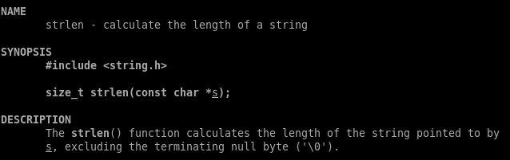
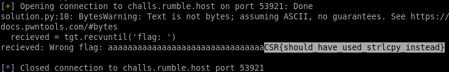

# \[Pwn\] - Flag Checker, Baby

#### Points = 100

## Prompt

This program is perfectly safe, right? It only tells you what you already know. Check your flags:

`nc challs.rumble.host 53921`

#### Hints
\[None\]

## Provided Files
[files](../../files/cybersecurityrumble/flag_checker_baby) - link to files
- baby_flag_checker.tar.gz
	- a tarball with the binary inside and C file inside

## Write Up

- step 1 is to extract the binary
- lets just walk through the source code
- main()
	- the flag is stored in an environment variable, `$FLAG`
	- main places our input in a 128-byte buffer.
	- main passes our input and the flag to the `check()` function.
- check()
	- if we input a string that is larger than 32-bytes, the method returns instantly
	- our input is copied into guess\[\] and the flag is copied into flag\[\]
	- the two buffers are compared using `strcmp()`, if they match we get the flag
		- this is interesting because they have different lengths
		- if it only compares until the first null-terminator, we can pass in the first chars of the flag, which are known to start with `CSR{`
- since guess and flag are laid out next to each other in memory, and a failed attempt prints out guess
	- if we remove the null-terminator from guess, the print statement should print out both strings coalesced.

#### Gameplan
- we will pass a string with 32 chars followed by a null terminator
	- we'll send `'a' * 32`
- `strlen()` in `check()` will return 32 because it excludes the null-terminator.

- now when we use `strncpy()` to copy from input to guess\[\], the null terminator will be dropped because we are only copying 32-bytes or `sizeof(guess)`
- used pwntools, code can be found in files.

## Flag

CSR{should_have_used_strlcpy_instead}