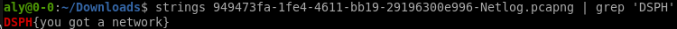

# \[Forensics\] - Dont_install

#### Points = 80

## Prompt

I am not a developer, but I love to play with my signature.

#### Hints
\[None\]

## Provided Files
[files](../../files/damncon2021/dont_install) - link to files

- 949473fa-1fe4-4611-bb19-29196300e996-Netlog.pcapng
	- looks like a regular packet capture file.

## Write Up

- since this is a forensics problem we start by verifying this is an acutal .pcap file.
	- `file 949473fa-1fe4-4611-bb19-29196300e996-Netlog.pcapng`
	- checks out
- lets first inspect the plaintext, would save some time if it works.
	- we know the flag will have the format `DSPH{}`
	- if this doesn't work then we can do packet analysis in wireshark

## Flag

DSPH{you_got_a_network}