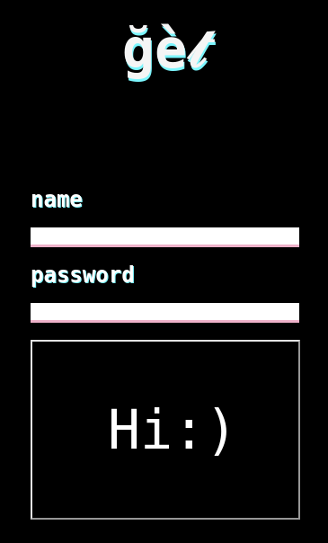
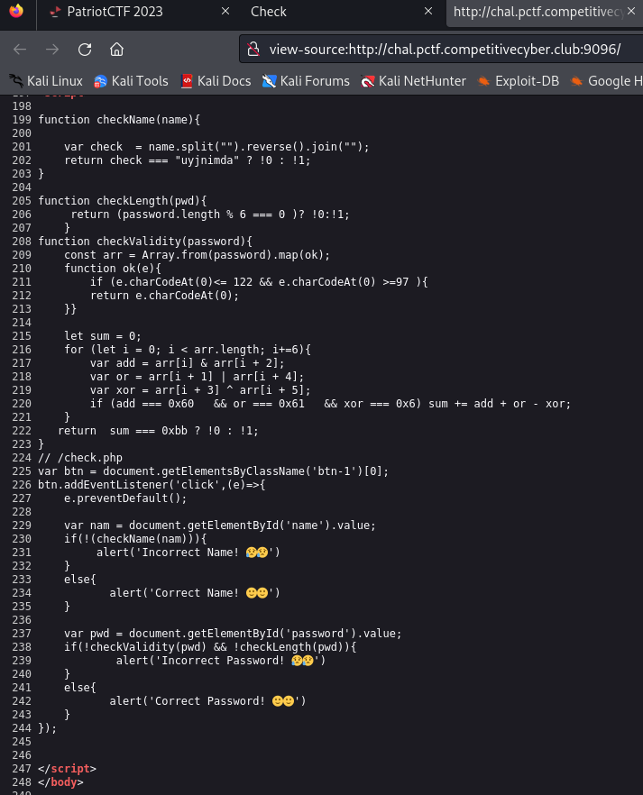
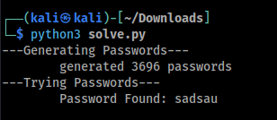
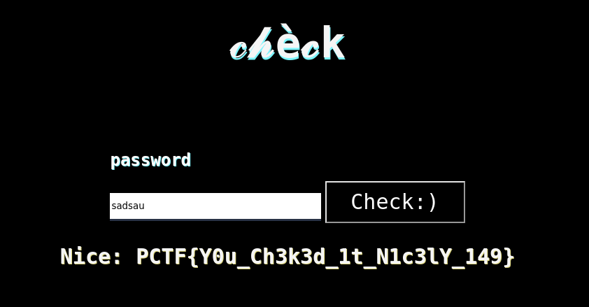

# \[Web\] - Checkmate

#### Difficulty = Medium

## Prompt

Get your adrenaline pumping as you navigate the thrilling world of Crypto Web for Capture the Flag.

`http://chal.pctf.competitivecyber.club:9096/`

## Write Up

First thing we see when we open this webpage is a login form.  
  

Looking at the page source we find some javascript code that shows us how the credential validation works.  
  

Looks like we have three functions that are used here:
- `checkName()`
	- checks that the names is equal to the reverse of `"uyjnimda"`
	- username: `echo uyjnimda | rev` -> `adminjyu`
- `checkLength()`
	- this function returns true if the length of the password is divisible by 6.
- `checkValidity()`
	- this function processes the input in chunks of 6 characters.
	- Line # 209 - the `Array.from(password).map(ok)` creates an array of characters with codes in the range \[97, 122\]. i.e. lowercase chars
	- we have to satisfy the following conditions
		- `input[0] & input[2] == 0x60`
			- we need two characters that have the bits of `0x60` in common
			- we can use `'a' = 0x61` and `'b' = 0x62`
		- `input[1] | input[4] == 0x61`
			- same process as `&` but with `'a' = %61` character
		- `input[3] ^ input[5] == 0x06`
			- XOR is reversible so if we pick `'a'` at random we can find a character to satisfy the condition using `'a' ^ 0x06 = 0x67 = 'g'`
	- Starting with these values we can use the [ascii](https://www.asciitable.com/) table and a hex calculator to construct a valid password.

After reading the code this challenge is actually pretty straight forward.
- Username = `adminjyu`
- Password = `aabaag`

From the page source we see a comment `// /check.php` on line 224.
The `/check.php` page has a field that sends a post request to itself with the password as a parameter. It doesn't accept the password from before.

There are many passwords that satisfy these conditions so I messaged an admin about it and he told me not to "manually guess". So the gameplan now is to generate all possible passwords and do a dictionary attack.

I wrote an ugly python script to do this. (bottom of the writeup)  


Now we can use the password to get the flag.  


## Flag

`PCTF{Y0u_Ch3k3d_1t_N1c3lY_149}`

---

## solve.py

- adding multithreading would make this a lot quicker

```
import requests 

def try_password(password): 
	url = 'http://chal.pctf.competitivecyber.club:9096/check.php' 
	params = {'password': password} res = requests.post(url, data=params) return 
	'incorrect password' not in res.text 
	
ands = [] 
xors = [] 

print('---Generating Passwords---') 

# figure out ands 
for i in range(97, 123): 
	for j in range (97, 123): 
		if i & j == 0x60: 
			pair = (chr(i), chr(j)) 
			ands.append(pair) 
			
# figure out xors 
	for i in range(97, 123): 
		for j in range (97, 123): 
			if i ^ j == 0x6: 
				pair = (chr(i), chr(j)) 
				xors.append(pair) 
				
print('\tgenerated ' + str(len(xors) * len(ands)) + ' passwords') 

print('---Trying Passwords---') 

# try all combos 
for first in ands: 
	for second in xors: 
		password = ['a'] * 6 # 'aaaaaa' 
		# plug in ands '&a&aaa' 
		password[0] = first[0] 
		password[2] = first[1] 
		# plug in xors '&a&!a!' 
		password[3] = second[0] 
		password[5] = second[1] 
		
		# make a guess 
		password = ''.join(password) 
		success = try_password(password) 
		if success: 
			print('\tPassword Found: ' + password) exit()
```