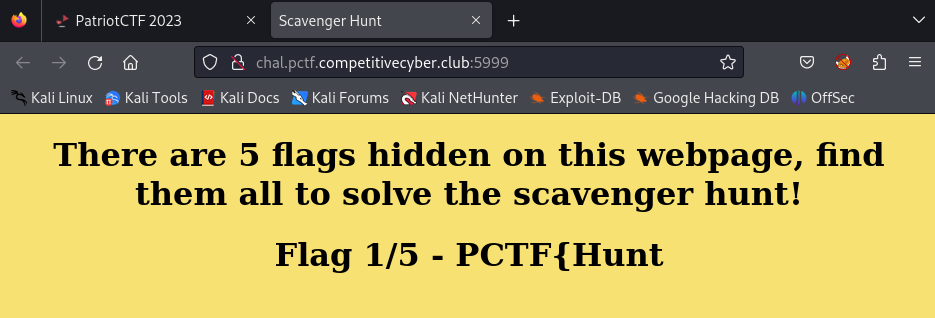
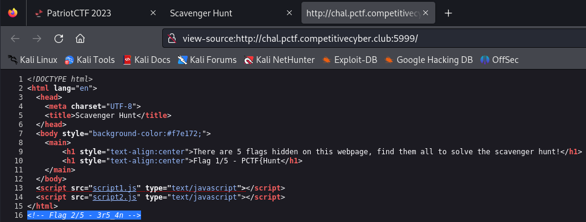
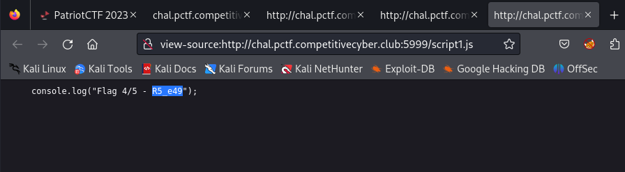
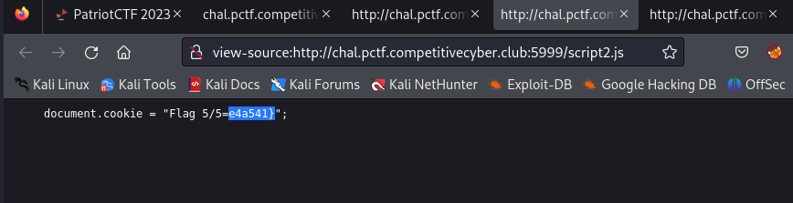
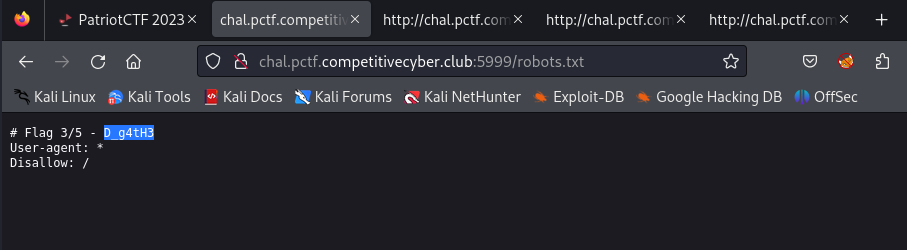

# \[Web\] - Scavenger Hunt

#### Difficulty = Easy
#### Points = Dynamic Scoring

## Prompt

Can you find all the hidden pieces of the flag?
`http://chal.pctf.competitivecyber.club:5999/`

## Write Up

This is a beginner challenge asking us to find "parts" of the flag. This sounds like it would be similar to one of the challenges in Offsec's PEN-200 course where you look through the page source, javascript, and css.  
  
The first part of the flag is on the index page so here is one.  

  
The second part can be found in an HTML comment.  

  
From the page source we find two javascript files `script1.js` and `script2.js` and they both have parts of the flag.  
    
  
  
   
The final part of the flag is found in `/robots.txt`  
  
  
I try to include more of my thought process as I do these challenges but sometimes they are too straightforward.
## Flag

`PCTF{Hunt3r5_4nD_g4tH3R5_e49e4a541}`