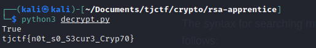

# \[Crypto\] - RSA Apprentice

#### Points = 127

## Prompt

My friend sent me this secret message but I can't figure out how to decrypt it! Can you help?

by nthistle

#### Hints
\[None\]

## Provided Files
[files](../../files/tjctf-2022/rsa_apprentice) - link to files

- `problem.txt` - text file with n, e, and two ciphertexts

## Write Up

```
==== SECRET RSA MESSAGE ====
n = 1216177716507739302616478655910148392804849
e = 65537
c1 = 257733734393970582988408159581244878149116
c2 = 843105902970788695411197846605744081831851
```

- looking at the constants, n looks kinda small. We can check if it has known factors.
- this should be the first step in any rsa chall - lookup on [factordb](http://factordb.com)
- the factors are known so it becomes trivial to decrypt the messages
	1. with the factors, we can calculate the totient
	2. with the totient, we can calculate the private exponent
	3. with the private exponent and n, we can decrypt the messages
- here is a python script that solves this chall:
	```
	from Crypto.Util.number import inverse

	n = 1216177716507739302616478655910148392804849
	e = 65537
	c1 = 257733734393970582988408159581244878149116
	c2 = 843105902970788695411197846605744081831851

	# n is too small - find factors online
	p = 1033247481589406269253
	q = 1177043968824330681533

	print(p * q == n)

	# calculate private exponent
	tot = (p - 1) * (q - 1)
	d = inverse(e, tot)

	# calculate plain-text
	m1 = pow(c1, d, n)
	m2 = pow(c2, d, n)

	# print plaintext
	pt = bytes.fromhex(hex(m1)[2:]).decode('ascii')
	pt += bytes.fromhex(hex(m2)[2:]).decode('ascii')
	print(pt)
	```
	- here is the output of the script
	

## Flag

tjctf{n0t_s0_S3cur3_Cryp70}