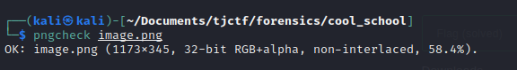
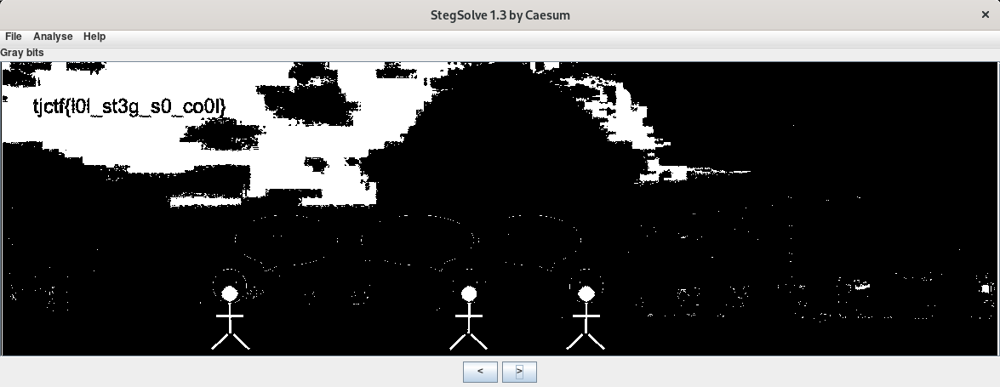

# \[Forensics\] - Cool School

#### Points = 131

## Prompt

Wow TJ is such a cool school! This image really captures the vibes. But something seems off about the image...

by andrewxie

#### Hints
\[None\]

## Provided Files
[files](../../files/tjctf-2022/cool_school) - link to files

- `cool_school.png` - a PNG image

## Write Up

- image forensics, we just go through the regular comands again.
- running `file cool_school.png` shows that it matches the PNG header
- running `strings cool_school.png` does not reveal anything useful.
- running `png_check cool_school.png` shows that there are no abnormailites.

- my next guess is maybe applying some color filters using stegsolve
- Stegsolve makes it very easy to skip through different color filters and see results.
	- by cycling through color filters we are able to reveal the flag

## Flag

tjctf{l0l_st3g_s0_co0l}