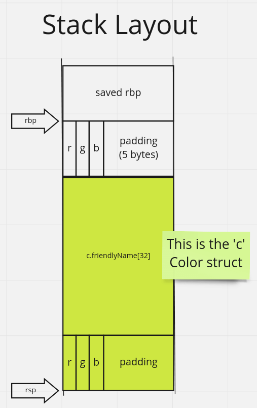
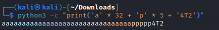
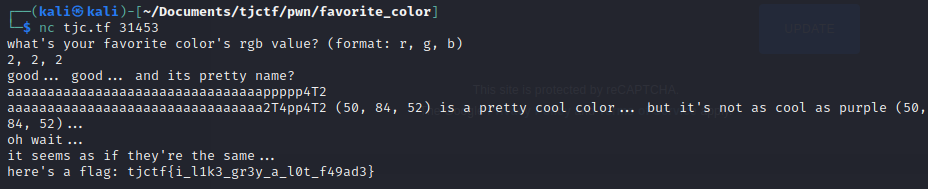

# \[Pwn\] - Favorite Color

#### Points = 187

## Prompt

I want to learn more about your favorite colors!

`nc tjc.tf 31453`

#### Hints
\[None\]

## Provided Files
[files](../../files/) - link to files

- `chall.c` - source code
- `chall` - compiled binary

## Write Up

- lets see what this program does
	- line #10 - there is a `myFavoriteColor` global variable
	`struct Color myFavoriteColor = {.friendlyName = "purple", .r = 0x32, .g = 0x54, .b = 0x34};`
	- line #19 - the program prompts the user for RGB values of their color
	- line #22 - the user's RGB values must be different from `myFavoriteColor`
	- line #28 - the program prompts the user for their color's name and places the input in struct `c`
	- lines #31 &rarr; #33 - the program sets struct `c`'s values based on the user input from before
	- line #39 - if the colors in struct `c` match `myFavoriteColor`, we get the flag
		
#### Strategy

- for the first input on line #19 we can pass any numbers for RGB that do not match `myFavoriteColor`
- After that the values will pass the check on line #22
- with the input on line #28 we can overflow the RGB values and set them to match `myFavoriteColor`
- our program will now set struct `c`'s colors with the same colors in `myFavoriteColor`
- we pass the check on line #39 and get the flag

#### What the stack looks like

- local variables are pushed on the stack in the order in which they are declared
- this is a 64-bit system so the stack must be 8-byte aligned.
	- before struct `c` can be pushed on the stack, 5 bytes of padding are added since each of `r`, `g`, and `b` are 1-byte characters.
- values needed:
	- `b = 0x34` = ascii '4'
	- `g = 0x54` = ascii 'T'
	- `r = 0x32` = ascii '2'

#### Designing a Payload
- we need 32 chars to fill `c.friendlyName`
- then we need 5 chars to fill the padding area
	- using different chars for this part for clarity
- then we overwrite the local variables in backwards order `4T2`
- payload:

- we can pass this payload over `nc` and get the flag

## Flag

tjctf{i_l1k3_gr3y_a_l0t_f49ad3}