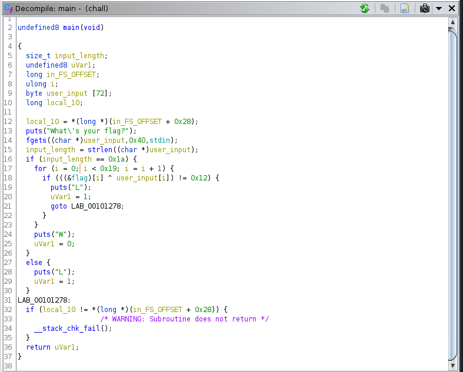
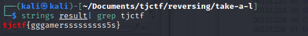
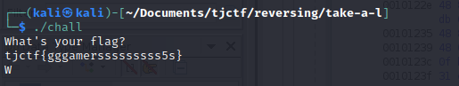

# \[Reversing\] - Take A L

#### Points = 157

## Prompt

I need W :angry:

by kpdfgo

#### Hints
\[None\]

## Provided Files
[files](../../files/tjctf-2022/take-a-l) - link to files

- `chall` - ELF binary

## Write Up

- lets run this binary to see what it does
	- the binary is a flag verifier
	- it prompts `What is your flag?`
	- it returns `L` if the flag is wrong and I'm guessing `W` if its correct
- lets look at this in Ghidra to how it verifies flags.
	- we import and analyze the binary
	- then we can look at the main fucntion in the decompiler window
	- with some refractoring we can deobfuscate the code

- let's analyze the binary
	- line #16 - input length must be `0x1a` or `26`
	- line #18 - there is a flag global variable
	- line #18 - the xor of each character in input with the corresponding character in flag should always be `0x12`
- xor is reversible so we can xor the global variable "flag" with `0x12` to retrieve the flag for this challenge

## Solution
- flag is a global var so we can easily find it and xor its bytes with `0x12` but I am lazy so I will just xor the entire file and `grep` out the flag.
- python script:
	- puts xor result in `result`
	```
	f = open('chall', 'rb')
	o = open('result', 'wb')

	in_bytes = bytearray(f.read())

	# xor all bytes
	for i in range(len(in_bytes)):
    	in_bytes[i] = in_bytes[i] ^ 0x12

	o.write(in_bytes)

	f.close()
	o.close()
	```
- grep the flag

- we can then verify the result in the program


## Flag

tjctf{gggamersssssssss5s}