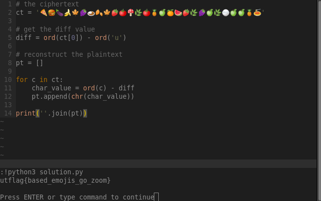

# \[Crypto\] - Base Emoji

#### Points = 200

## Prompt

base64 is a boomer algorithm, so I've created a zooomer standard for encoding data. Can you figure out the encoding? 🍕🍔🍆🍌🍁🍇🍛🍂🍁🍓🍅🍄🌿🍅🍍🍏🍊🍉🍓🌿🍇🍏🌿🍚🍏🍏🍍🍝

by mattyp

#### Hints
\[None\]

## Provided Files

\[None\]

## Write Up

- I've seen this in many ctfs before, usually it is the first letter of each emoji object \[🍕 = pizza = p\]
- this does not seem to be the case here so there might be some kind of substitution cipher on top of it.
	- first three letters would be "phe", we're expecting "utc" because flags start with "utctf{"

#### first letter approach
- using an online <a href="https://emojitranslate.com/">tool</a>.
	- output: "pizza hamburger eggplant banana maple leaf grapes curry rice fallen leaf maple leaf strawberry tomato mushroom herb tomato pineapple green apple tangerine watermelon strawberry herb grapes green apple herb cooked rice green apple green apple pineapple spaghetti"
	- first letters: "phebmlgcrflmlstmhtpgatwshggahcrgagaps"
	- tried decoding with a shift value of 21 to turn the 'p' into a 'u'.
		- output: ''umjgrqlhwkqrqxyrmyulfybxmllfmhwlflfux", dead end

#### base64

- the challenge text mentions base64 maybe this is a hint
- using this <a href="https://www.branah.com/uncode-converter/">tool</a>, converting the emojis to uncode produces the following.
	```
	\xf0\x9f\x8d\x95\xf0\x9f\x8d\x94\xf0\x9f\x8d\x86\xf0\x9f\x8d\x8c\xf0\x9f\x8d\x81\xf0\x9f\x8d\x87\xf0\x9f\x8d\x9b\xf0\x9f\x8d\x82\xf0\x9f\x8d\x81\xf0\x9f\x8d\x93\xf0\x9f\x8d\x85\xf0\x9f\x8d\x84\xf0\x9f\x8c\xbf\xf0\x9f\x8d\x85\xf0\x9f\x8d\x8d\xf0\x9f\x8d\x8f\xf0\x9f\x8d\x8a\xf0\x9f\x8d\x89\xf0\x9f\x8d\x93\xf0\x9f\x8c\xbf\xf0\x9f\x8d\x87\xf0\x9f\x8d\x8f\xf0\x9f\x8c\xbf\xf0\x9f\x8d\x9a\xf0\x9f\x8d\x8f\xf0\x9f\x8d\x8f\xf0\x9f\x8d\x8d\xf0\x9f\x8d\x9d
	```
- tried using cyberchef to check 'to' and 'from' base64 but got nowhere.

#### Simple Unicode Shift

- this is an easy problem, what if this is just a direct mapping to utf-8 lowercase chars?
- the emoji is `\xf0\x9f\x8d\x95`, and the first expected letter 'u' is `\x75`
	- subtract them using a hex calulator, result = `F09F8D20`
	- if `second_emoji - diff = 't'` then we know its a direct mapping, 't' is `\x74`
	- `f09f8d94 - diff` results in `74`, LETS GO!
-  lets put this in python rq
	-  code can be found in files.




## Flag

utflag{based_emojis_go_zoom}
