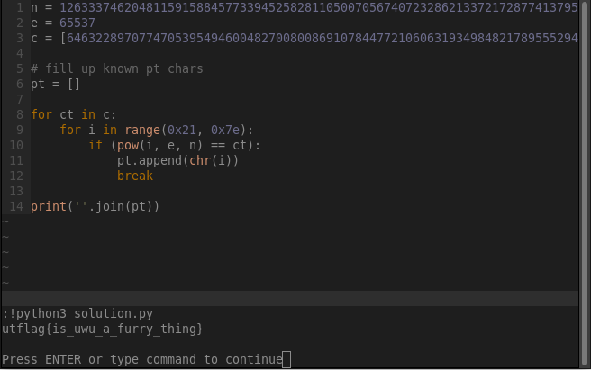

# \[Crypto\] - RSA

#### Points = 300

## Prompt

RSA is based.

#### Hints
\[None\]

## Provided Files

- rsa.txt
	- a collection of cipher texts, the modulus (n), the public exponent (e)
- code.py
	- encrypts every character from the flag separately and adds the result to the list called 'c'.

## Write Up

- this should be really easy.
- in rsa the ciphertext is generated using the public exponent as follows
	- `cipher_text = (plain_text ** e) % n`
- since the letters are encrypted one by one and we have the ciphertexts, we can brute force the plaintext chars.
- using this <a href="https://www.utf8-chartable.de">chart</a> we know this will be in range \[0x21 - 0x7e\]
- code can be found in files

## Flag

utflag{is_uwu_a_furry_thing}