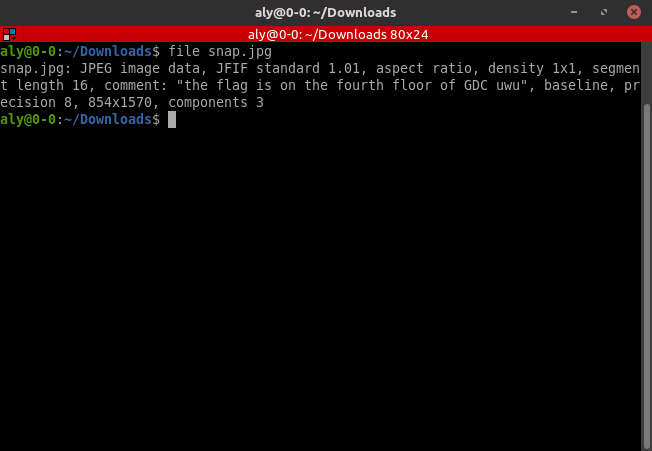
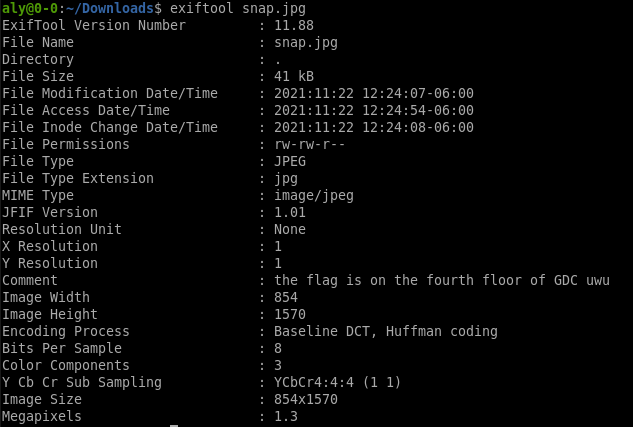

# \[Forensics\] - SCavenger Hunt

#### Points = 200

## Prompt

Can you find the flag? I have a partial snap of it, but something seems kinda weird. I could have sworn SnapChat strips off most of the metadata...

By Aya (@Aya the Awesome on discord)

#### Hints
\[None\]

## Provided Files

- snap.jpg
	- a snapchat screenshot
	- looks like a jpeg. From the prompt I am guessing that the flag is in the metedata.

## Write Up

- first lets make sure it is a jpeg using the `file` command.

- we can actually see a comment which could be the solution for this challenge but lets check the metadata anyway.
- a good tool to extract metadata is `exiftool`

- the comment says that the flag is on the fourth floor of gdc
	- i really hope I don't actually have to go there.
	- i stopped here

#### After Checking ISSS writeup

- so the flag was actually written on a white board on the fourth floor of UT Austin's Gates-Dell Complex
- this would have been fun if you're in-person but there is basically no way to get this if you're doing the ctf from a different location

## Flag

utflag{thats_so_meta}