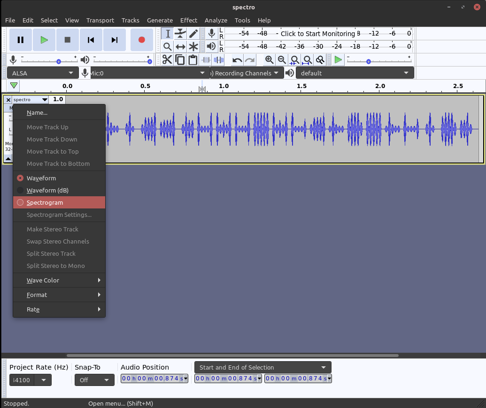
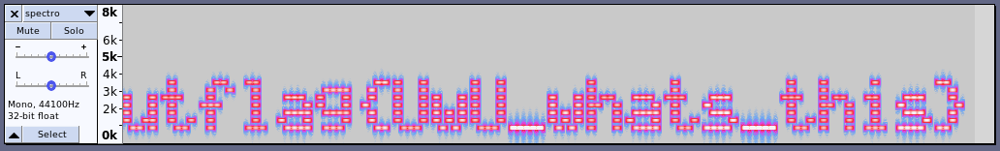

# \[Forensics\] - Spectro

#### Points = 250

## Prompt

Can you take a look at this audio fille? There might be something odd with the frequencies. 
by ggu

#### Hints
\[None\]

## Provided Files

- spectro.wav
	- an audio file which sounds very wierd.

## Write Up

- Aya (an ISSS officer) gave a <a href="https://github.com/utisss/talks/blob/master/beginner-series/Forensics.pdf">forensics talk</a> a few weeks ago which mentioned  messing with audio files.
- If we `ctrl+f` the slides we find that we can create a spectogram by opening this file in Audacity.
- Steps
	- open Audacity
	- `ctrl+o` and choose the file to open it.
	- click the drop-down menu for the track and choose the "spectrogram" option.
	
	
	
	
	- the spectro gram view reveals the flag.

	

## Flag

utflag{UwU_whats_this}