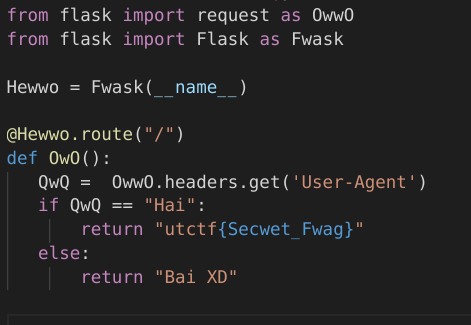
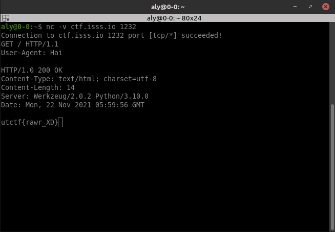

# \[Networking\] - Hai

#### Points = 100

## Prompt

Hai,



Try to find my secwet fwag,

\[http://ctf.isss.io:1232/ \]

#### Hints
\[None\]

## Provided Files

\[None\]

## Write Up

- this code checks the User-Agent HTTP request header
- We can use netcat to send an HTTP request to send `User-Agent: "Hai"`
- Steps
	- open a connection in a terminal `nc ctf.isss.io 1232`
		- you can run this in verbose mode by adding `-v` to make sure the connection is successful.
	- construct an HTTP request as follows
	```
	GET / HTTP/1.1
	User-Agent: Hai
	
	
	```
	- make sure that the request ends with two empty lines.

	
	
## Flag

utctf{rawr_XD}